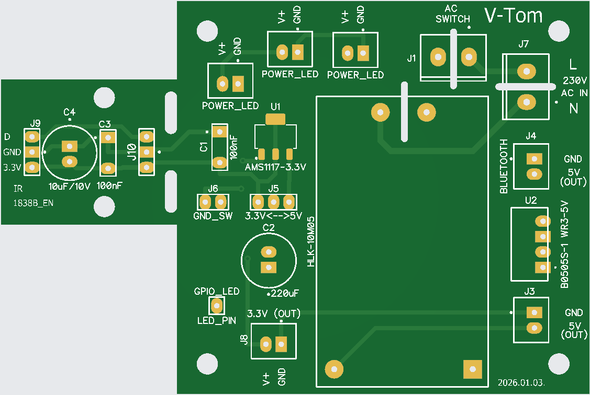
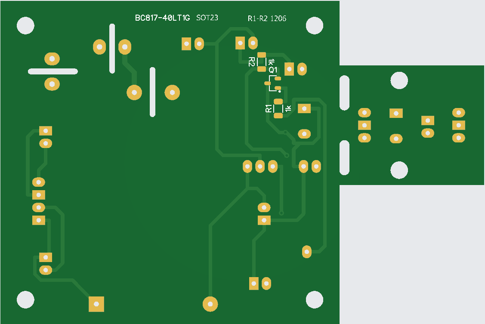
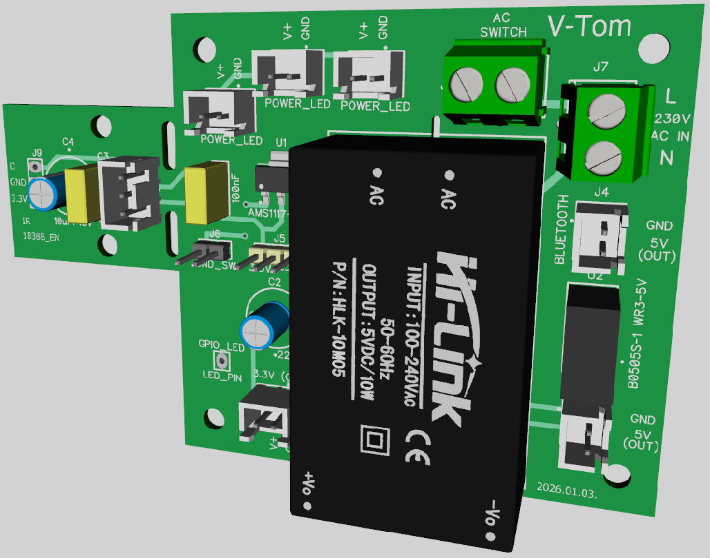
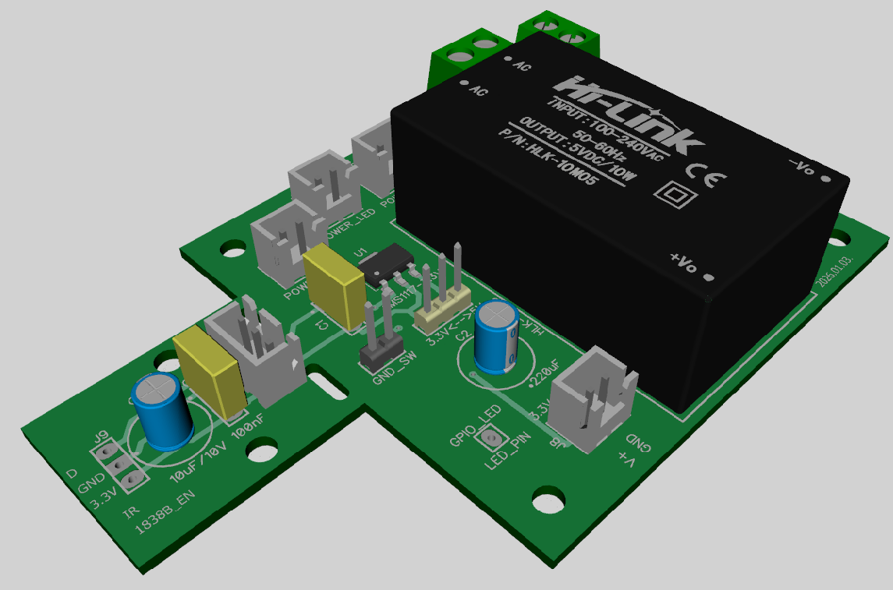
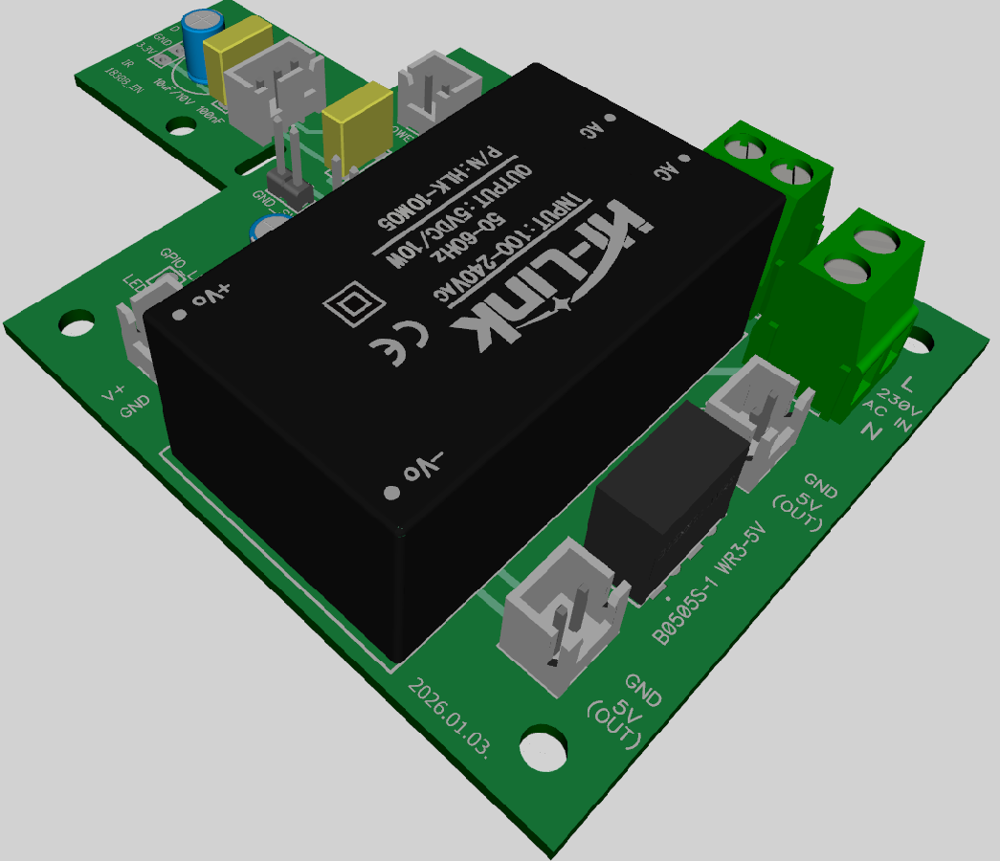

# Tápegység – verzió: 2026.01.03.

- **PCB mérete:** 97 × 65 mm
- **SMD ellenállások mérete:** 1206 
- **SMD tranzisztor mérete:** SOT23
- Kapcsolási rajz PDF formátumban letölthető: [wiring_diagram_2026_jan_03.pdf](../../PCB/Power_supply_with_IR_sensor/wiring_diagram_2026_jan_03.pdf) 
- A panel úgy van tervezve, hogy az infra LED fogadására is alkalmas annak szűrőkondenzátoraival. Szükség esetén ez leválasztható a tápegységről. 
- 3 darab LED kimenet van rajta melyek két féle módban használahatóak.
    - NPN taranzisztoron keresztül (BC817) R1 1KΩ ellenálláson át valamelyik GPIO - val magas jelszinten vezérelve, R2 1KΩ. a LED -el sorba kötve a led maximális áramerősségét állítja be.
    - J6 jumper átkötésével fix 3.3V, R2 1KΩ. a LED -el sorba kötve a led maximális áramerősségét állítja be.
- J3 --> 5V 2A kimentet közvetlenül a HLK-10M05 -ön keresztül.
- J4 --> 5V 0.8A leválasztott kimenet (B0505S-1 WR3-5V) amely alkalmas a hátlapra szerelt USB aljzat megtáplálására, így zajmentes Bluetooth adót csatlakoztathatunk.
### Top

  

### Bottom 
    

### 3D top
  

### 3D left side
  

### 3D right side
  

### A B0505S‑1WR3 egy DC-DC konverter (feszültségátalakító) modul.
Ez azt jelenti, hogy egy adott egyenáramú feszültséget másik egyenáramú feszültséggé alakítson át, miközben villamosan elválasztja (izolálja) a bemenetet és a kimenetet egymástól.
- Bemenet: kb. 5 V DC
- Kimenet: 5 V DC (stabil, izolált)
- Kimeneti áram: ~800 mA

Az ilyen modult akkor érdemes használni, ha például egy mikrokontroller vagy más érzékeny elektronika tápjáról szeretnél leválasztott, stabil 5 V-ot, vagy elektromos zaj/csatlakozási problémák miatt fontos az izoláció. Ebben az esetben a **POWER_OUT** kivezetésen keresztül lehetőség nyílik egy USB transmitter megtáplálására így annak hangjában nem lesz hallható az elektrónika által okozott nagyfrekvenciás zaj. 

### Ez a PCB verzió legyártható a [jlcpcb.com](https://jlcpcb.com/) oldalon a [power_supply_gerber.zip](../../PCB/Power_supply_with_IR_sensor/power_supply_gerber.zip)   fájl feltöltésével.     

## Itt meghívhatsz egy kávéra!!!     
https://buymeacoffee.com/vtom
