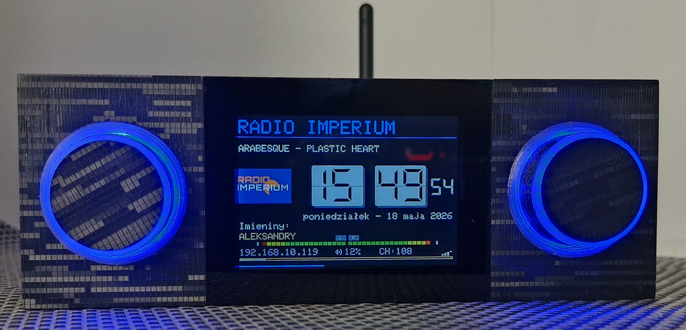

# yoRadio TB — Build Guide (Quick Start)

Krótka instrukcja montażu i pierwszego uruchomienia.
Szczegółowe opisy: [zbudujradio.pl](https://www.zbudujradio.pl).

## Zakres instrukcji

Ten dokument obejmuje tylko:

- quick start,
- montaż,
- pierwsze uruchomienie,
- podstawową konfigurację.

## 1. Co przygotować

### 1.1 Części (HiFi 3,5")

| Komponent | Model / opis | Ilość |
|---|---|---:|
| Mikrokontroler z Wi-Fi i BT | ESP32S3 N16R8 42 lub 44 pin | 1 szt. |
| Wyświetlacz TFT bez dotyku | ILI9488 3,5" | 1 szt. |
| DAC I2S | PCM5102A | 1 szt. |
| Enkoder obrotowy | EC-11 z przyciskiem | 2 szt. |
| Gniazdo zasilania/komunikacji | USB-C 4 pin | 1 szt. |
| Śrubki | M2,5x10, czarne stożkowe | 26 szt. |
| Nakrętki | M2,5 | 10 szt. |
| Antena | Antena zewnętrzna do ESP32 | 1 szt. |
| Gniazdo audio | Gniazdo cinch przykręcane | 2 szt. |
| Płytka PCB | Dedykowana pod ILI9488 3,5" ([grupa](https://www.facebook.com/groups/730111842962074/)) | 1 szt. |
| Obudowa 3D | Model obudowy ([MakerWorld](https://makerworld.com/pl/models/2818265-yoradio-3-5-case-housing-with-usb-c-for-ili9488#profileId-3138068)) | 1 kpl |
| Kabelki | Podwójny ekranowany 15 cm + taśma 5 żył 30 cm | 1 kpl |

Źródło listy: [zbudujradio.pl/lista.html](https://www.zbudujradio.pl/lista.html)

### 1.2 Narzędzia

- lutownica + cyna,
- multimetr,
- pęseta/szczypce,
- śrubokręty precyzyjne (torx 2,5mm, krzyżak PH00),
- komputer z przeglądarką Edge lub Chrome.

## 2. Zdjęcia referencyjne (uzupełnij)

## 3. Montaż

Checklist:

- [ ] Do czujnika podczerwieni przylutuj przewody zgodnie ze schematem i przyklej do przedniej obudowy.
- [ ] Zamontuj wyświetlacz w obudowie.
- [ ] Zamontuj na wyświetlaczu płytkę z mikrokontrolerem.
- [ ] Zamontuj przezroczyste koszyki enkoderów i przyklej je. i podłącz je do płytki przewodami.
- [ ] Zamontuj i przyklej ringi LED, połącz je przewodami oraz z płytką ESP32S3 zgodnie ze schematem.
- [ ] Zamontuj enkodery i przylutuj im przewody 15cm.
- [ ] Przylutuj do płytki kondensatory ceramiczne, rezystory, gniazda, goldpiny i skonfigurowany dekoder (patrz film) [https://www.youtube.com/watch?v=dtAzlmKShKM](https://www.youtube.com/watch?v=dtAzlmKShKM).
- [ ] Zamontuj na wyświetlaczu płytkę z mikrokontrolerem.
- [ ] Przylutuj przewody enkoderów do ENC1 i ENC2 (patrz opisy pinów).
- [ ] Zamontuj ścianki boczne, dolną i tylną.
- [ ] Zamontuj na tylnej ściance gniazda RCA, USB i antenę.
- [ ] Sprawdź, czy przewody nie będą dociskane przez obudowę.
- [ ] Przylutuj do gniazda usb wtyk USB-C, patrz na opisy (GND-czarny), pomyłka uszkodzi mikrokontroler.
- [ ] Sprawdź brak zwarcia linii 3,3V i 5V-GND przed podaniem zasilania.

Szczegółowe schematy i pinout: [zbudujradio.pl](https://www.zbudujradio.pl)

## 4. Pierwsze uruchomienie

Checklist:

- [ ] Podłącz radio przez USB.
- [ ] Wgraj firmware przez przeglądarkę Edge lub Chrome [zbudujradio.pl/flash.html](https://www.zbudujradio.pl/flash.html)
- [ ] Potwierdź start urządzenia (ekran startowy).
- [ ] Potwierdź działanie enkodera i przycisku.

Jeśli potrzebujesz pełnej procedury software: [zbudujradio.pl](https://www.zbudujradio.pl)

## 5. Podstawowa konfiguracja

- [ ] Ustaw Wi-Fi.
- [ ] Ustaw podstawowe opcje audio (korektor).
- [ ] Przetestuj stację radiową.
- [ ] Sprawdź poziom głośności.

## 6. Szybka diagnostyka

| Objaw | Szybkie sprawdzenie |
|---|---|
| Brak obrazu | Zasilanie LCD |
| Brak dźwięku | Wyjście audio, głośność |
| Enkoder nie działa | Piny enkodera |

## 7. Linki

- Strona projektu: [https://www.zbudujradio.pl](https://www.zbudujradio.pl)
- Repozytorium: [https://github.com/tomaszbunio/yoRadio_TB](https://github.com/tomaszbunio/yoRadio_TB)
- Materiały wideo: [https://www.zbudujradio.pl](https://www.zbudujradio.pl)

## 8. Status dokumentu

- Wersja: `v0.1`
- Format źródłowy: Markdown
- Eksport: PDF (`docs/pdf/`)
